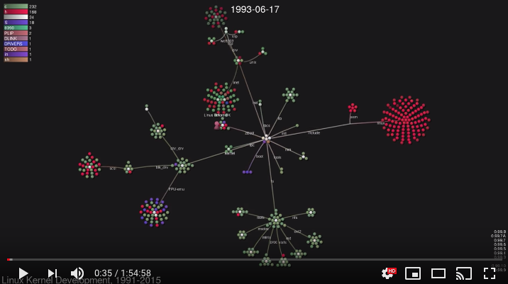
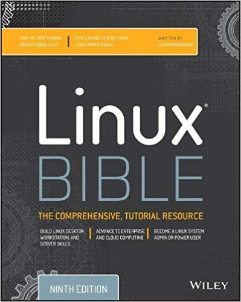

# Linux 

This online document helps the absolute beginners to persue the future direction in coding and handeling Linux operating system. Linux is the epitom of open source development initiated by Linus Torvald in 1991. The Youtube video imbeded below shows the history of development of Linux.

        
### Why use Linux?

Linux is a backbone of  Cloud computing. From past days, it is being selected as a standard operating system for scientific computing data mining. Two paradigms of computing called parallel and distributed computing have evolved in modern days. Both of them prefer the Linux operating system due to it's flexible administrative and server implementation. 

### From where to learn Linux ? 

Yo will never regret on keeping this book in your bookself.

These are the ***key features*** in the Linux operating system:

 - File system
 - Process
 - User management
 - Software Installation
 - File/document management
 - Storage management 
 - Networking and Server

#### Why do people prefer Linux? 

- Linux is also distributed under an open source license. Open source follows the following key philosophies:

- The freedom to run the program, for any purpose.

- The freedom to study how the program works, and change it to make it do what you wish.

- The freedom to redistribute copies so you can help your neighbor.

- The freedom to distribute copies of your modified versions to others.

The above are crucial to understanding the community that comes together to create the Linux platform. It is, without a doubt, an operating system that is “by the people, for the people”. These philosophies are also one of the main reasons a large percentage of people use Linux. It’s about freedom and freedom of choice.

### Sources
1. [www.linux.com](https://www.linux.com/what-is-linux)

 